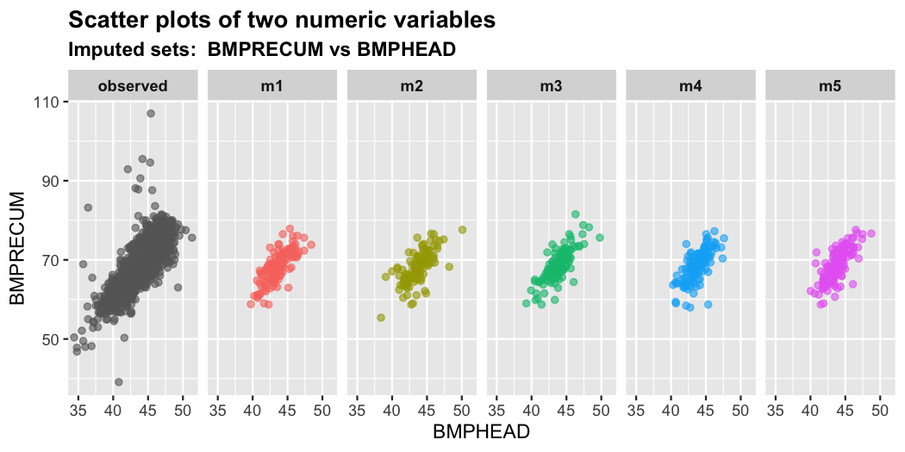
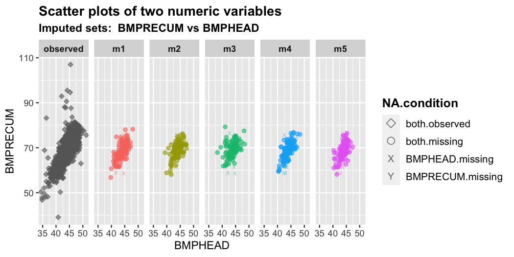

<!-- README.md is generated from README.Rmd. Please edit that file -->

# miae

<!-- badges: start -->
<!-- badges: end -->

**miae** is an R package for multiple imputation through autoencoders
built with **Torch**. It’s currently under development.

## 1. Installation

You can install the current development version of miae from
[GitHub](https://github.com/) with:

``` r
# install.packages("devtools")
#devtools::install_github("agnesdeng/miae")
```

``` r
# To load the nhanes3_newborn dataset from the R package
# mixgb
library(mixgb)
# To obtain visualization diagnostics plot
library(vismi)
# Multiple imputation through autoencoder
library(miae)
```

## 2. Multiple imputation with denoising autoencoder with dropout

``` r
# load the nhanes3_newborn dataset from the R package mixgb
data("nhanes3_newborn")
str(nhanes3_newborn)
#> tibble [2,107 × 16] (S3: tbl_df/tbl/data.frame)
#>  $ HSHSIZER: int [1:2107] 4 3 5 4 4 3 5 3 3 3 ...
#>  $ HSAGEIR : int [1:2107] 2 5 10 10 8 3 10 7 2 7 ...
#>  $ HSSEX   : Factor w/ 2 levels "1","2": 2 1 2 2 1 1 2 2 2 1 ...
#>  $ DMARACER: Factor w/ 3 levels "1","2","3": 1 1 2 1 1 1 2 1 2 2 ...
#>  $ DMAETHNR: Factor w/ 3 levels "1","2","3": 3 1 3 3 3 3 3 3 3 3 ...
#>  $ DMARETHN: Factor w/ 4 levels "1","2","3","4": 1 3 2 1 1 1 2 1 2 2 ...
#>  $ BMPHEAD : num [1:2107] 39.3 45.4 43.9 45.8 44.9 42.2 45.8 NA 40.2 44.5 ...
#>   ..- attr(*, "label")= chr "Head circumference (cm)"
#>  $ BMPRECUM: num [1:2107] 59.5 69.2 69.8 73.8 69 61.7 74.8 NA 64.5 70.2 ...
#>   ..- attr(*, "label")= chr "Recumbent length (cm)"
#>  $ BMPSB1  : num [1:2107] 8.2 13 6 8 8.2 9.4 5.2 NA 7 5.9 ...
#>   ..- attr(*, "label")= chr "First subscapular skinfold (mm)"
#>  $ BMPSB2  : num [1:2107] 8 13 5.6 10 7.8 8.4 5.2 NA 7 5.4 ...
#>   ..- attr(*, "label")= chr "Second subscapular skinfold (mm)"
#>  $ BMPTR1  : num [1:2107] 9 15.6 7 16.4 9.8 9.6 5.8 NA 11 6.8 ...
#>   ..- attr(*, "label")= chr "First triceps skinfold (mm)"
#>  $ BMPTR2  : num [1:2107] 9.4 14 8.2 12 8.8 8.2 6.6 NA 10.9 7.6 ...
#>   ..- attr(*, "label")= chr "Second triceps skinfold (mm)"
#>  $ BMPWT   : num [1:2107] 6.35 9.45 7.15 10.7 9.35 7.15 8.35 NA 7.35 8.65 ...
#>   ..- attr(*, "label")= chr "Weight (kg)"
#>  $ DMPPIR  : num [1:2107] 3.186 1.269 0.416 2.063 1.464 ...
#>   ..- attr(*, "label")= chr "Poverty income ratio"
#>  $ HFF1    : Factor w/ 2 levels "1","2": 2 2 1 1 1 2 2 1 2 1 ...
#>  $ HYD1    : Ord.factor w/ 5 levels "1"<"2"<"3"<"4"<..: 1 3 1 1 1 1 1 1 2 1 ...
colSums(is.na(nhanes3_newborn))
#> HSHSIZER  HSAGEIR    HSSEX DMARACER DMAETHNR DMARETHN  BMPHEAD BMPRECUM 
#>        0        0        0        0        0        0      124      114 
#>   BMPSB1   BMPSB2   BMPTR1   BMPTR2    BMPWT   DMPPIR     HFF1     HYD1 
#>      161      169      124      167      117      192        7        0
```

``` r
#use default setting
midae.default <- midae(data = nhanes3_newborn, m = 5,
                       save.model = TRUE, path = file.path (tempdir ( ), "midaemodel.pt"))
)
```

``` r
# use customized setting
params <- list(input.dropout = 0.1, hidden.dropout = 0.3, optimizer = "adamW",
    learning.rate = 1e-04, encoder.structure = c(128, 64, 32),
    decoder.structure = c(32, 64, 128), scaler = "robust", act = "elu",
    init.weight = "he.normal.elu.dropout")

midae.data <- midae(data = nhanes3_newborn, m = 5, categorical.encoding = "onehot",
    device = "cpu", epochs = 10, batch.size = 32, subsample = 1,
    early.stopping.epochs = 1, dae.params = params, pmm.type = NULL,
    save.model = FALSE, path = file.path(tempdir(), "midaemodel.pt"))
#> [1] "cpu"
#> [1] "Running midae()."
#> Loss at epoch 1: 12.742303
#> Loss at epoch 2: 11.805174
#> Loss at epoch 3: 11.027690
#> Loss at epoch 4: 10.199140
#> Loss at epoch 5: 9.571312
#> Loss at epoch 6: 9.027369
#> Loss at epoch 7: 8.628547
#> Loss at epoch 8: 8.427220
#> Loss at epoch 9: 8.088479
#> Loss at epoch 10: 7.923125
```

``` r
# obtain the fifth imputed dataset
midae.data[[5]]
```

``` r
# show the imputed values for missing entries in the
# variable 'BMPHEAD'
show_var(imputation.list = midae.data, var.name = "BMPHEAD",
    original.data = nhanes3_newborn)
#>            m1       m2       m3       m4       m5
#>   1: 42.06059 42.85000 43.89252 44.15647 41.92642
#>   2: 44.01146 42.87655 42.93002 43.94204 40.74512
#>   3: 41.87237 41.49434 44.63226 42.82038 43.88140
#>   4: 41.73535 43.62703 43.71303 44.79532 43.43610
#>   5: 42.57945 41.74102 45.64261 42.84653 43.69893
#>  ---                                             
#> 120: 44.83619 44.37527 44.66512 43.90899 43.33476
#> 121: 44.29740 43.88688 43.68660 43.83380 42.30541
#> 122: 41.99109 42.14834 43.79788 41.85656 41.97642
#> 123: 46.61103 44.46716 45.43449 44.54855 45.87122
#> 124: 40.73145 44.41811 41.89078 43.24716 44.48600
plot2D(imputation.list = midae.data, var.x = "BMPHEAD", var.y = "BMPRECUM",
    original.data = nhanes3_newborn)
```



## 3. Multiple imputation with variational autoencoder

``` r
#use default setting
mivae.default <- mivae(data = nhanes3_newborn, m = 5,
                       save.model = TRUE, path = file.path (tempdir ( ), "mivaemodel.pt"))
)
```

``` r
# use customized setting
params <- list(beta = 0.95, optimizer = "adamW", learning.rate = 1e-04,
    encoder.structure = c(128, 64, 32), decoder.structure = c(32,
        64, 128), scaler = "robust", act = "elu", init.weight = "he.normal.elu")

mivae.data <- mivae(data = nhanes3_newborn, m = 5, categorical.encoding = "onehot",
    device = "cpu", epochs = 10, batch.size = 32, subsample = 1,
    vae.params = params, pmm.type = NULL, save.model = FALSE,
    path = file.path(tempdir(), "mivaemodel.pt"))
#> [1] "cpu"
#> [1] "Running mivae()."
#> Loss at epoch 1: 29.801553
#> Loss at epoch 2: 18.865960
#> Loss at epoch 3: 15.507260
#> Loss at epoch 4: 13.625918
#> Loss at epoch 5: 12.683349
#> Loss at epoch 6: 12.053438
#> Loss at epoch 7: 11.616923
#> Loss at epoch 8: 11.170577
#> Loss at epoch 9: 10.975068
#> Loss at epoch 10: 10.719830
```

``` r
plot2D(imputation.list = mivae.data, var.x = "BMPHEAD", var.y = "BMPRECUM",
    original.data = nhanes3_newborn, shape = T)
```



## 4. Impute new data using a saved imputation model

``` r
set.seed(2023)
n <- nrow(nhanes3_newborn)
idx <- sample(1:n, size = round(0.7 * n), replace = FALSE)
train.data <- nhanes3_newborn[idx, ]
test.data <- nhanes3_newborn[-idx, ]
```

``` r
mivae.obj <- mivae(data = train.data, m = 5, categorical.encoding = "onehot",
    device = "cpu", epochs = 10, batch.size = 32, vae.params = params,
    pmm.type = NULL, save.model = TRUE, path = file.path(tempdir(),
        "mivaemodel.pt"))
#> [1] "cpu"
#> [1] "Running mivae()."
#> Loss at epoch 1: 25.185160
#> Loss at epoch 2: 17.317467
#> Loss at epoch 3: 14.648660
#> Loss at epoch 4: 13.337311
#> Loss at epoch 5: 12.620026
#> Loss at epoch 6: 11.949572
#> Loss at epoch 7: 11.701335
#> Loss at epoch 8: 11.458507
#> Loss at epoch 9: 11.220618
#> Loss at epoch 10: 11.013243
#> [1] "The VAE multiple imputation model is saved in  /var/folders/wz/s9x7fy7d2wsgmcf5kfcv040h0000gn/T//RtmpQDZE9E/mivaemodel.pt"
```

``` r
mivae.newdata <- impute_new(object = mivae.obj, newdata = test.data,
    m = 5)
```
