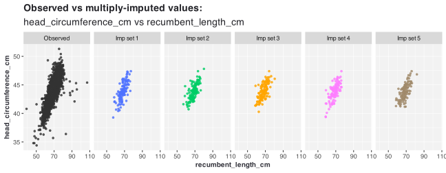
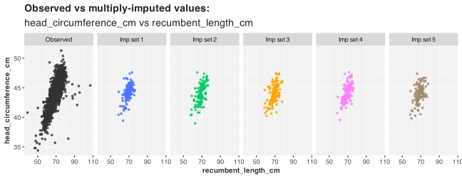

<!-- README.md is generated from README.Rmd. Please edit that file -->

# miae <a href="https://agnesdeng.github.io/miae/"></a>

<!-- badges: start -->

<!-- badges: end -->

**miae** is an R package for multiple imputation through autoencoders
built with **Torch**.

## 1. Installation

You can install the current development version of miae from
[GitHub](https://github.com/) with:

``` r
# install.packages("devtools")
#devtools::install_github("agnesdeng/miae")
```

``` r
# To load the newborn dataset from the R package mixgb
library(mixgb)
# To obtain visualization diagnostics plot
library(vismi)
# Multiple imputation through autoencoder
library(miae)
#> 
#> Attaching package: 'miae'
#> The following objects are masked from 'package:mixgb':
#> 
#>     createNA, impute_new
```

## 2. Multiple imputation with denoising autoencoder with dropout

``` r
# load the newborn dataset from the R package mixgb
data("newborn")
str(newborn)
#> tibble [2,107 × 16] (S3: tbl_df/tbl/data.frame)
#>  $ household_size                : int [1:2107] 4 3 5 4 4 3 5 3 3 3 ...
#>  $ age_months                    : int [1:2107] 2 5 10 10 8 3 10 7 2 7 ...
#>  $ sex                           : Factor w/ 2 levels "Male","Female": 2 1 2 2 1 1 2 2 2 1 ...
#>  $ race                          : Factor w/ 3 levels "White","Black",..: 1 1 2 1 1 1 2 1 2 2 ...
#>  $ ethnicity                     : Factor w/ 3 levels "Mexican-American",..: 3 1 3 3 3 3 3 3 3 3 ...
#>  $ race_ethinicity               : Factor w/ 4 levels "Non-Hispanic White",..: 1 3 2 1 1 1 2 1 2 2 ...
#>  $ head_circumference_cm         : num [1:2107] 39.3 45.4 43.9 45.8 44.9 42.2 45.8 NA 40.2 44.5 ...
#>  $ recumbent_length_cm           : num [1:2107] 59.5 69.2 69.8 73.8 69 61.7 74.8 NA 64.5 70.2 ...
#>  $ first_subscapular_skinfold_mm : num [1:2107] 8.2 13 6 8 8.2 9.4 5.2 NA 7 5.9 ...
#>  $ second_subscapular_skinfold_mm: num [1:2107] 8 13 5.6 10 7.8 8.4 5.2 NA 7 5.4 ...
#>  $ first_triceps_skinfold_mm     : num [1:2107] 9 15.6 7 16.4 9.8 9.6 5.8 NA 11 6.8 ...
#>  $ second_triceps_skinfold_mm    : num [1:2107] 9.4 14 8.2 12 8.8 8.2 6.6 NA 10.9 7.6 ...
#>  $ weight_kg                     : num [1:2107] 6.35 9.45 7.15 10.7 9.35 7.15 8.35 NA 7.35 8.65 ...
#>  $ poverty_income_ratio          : num [1:2107] 3.186 1.269 0.416 2.063 1.464 ...
#>  $ smoke                         : Factor w/ 2 levels "Yes","No": 2 2 1 1 1 2 2 1 2 1 ...
#>  $ health                        : Ord.factor w/ 5 levels "Excellent"<"Very Good"<..: 1 3 1 1 1 1 1 1 2 1 ...
colSums(is.na(newborn))
#>                 household_size                     age_months 
#>                              0                              0 
#>                            sex                           race 
#>                              0                              0 
#>                      ethnicity                race_ethinicity 
#>                              0                              0 
#>          head_circumference_cm            recumbent_length_cm 
#>                            124                            114 
#>  first_subscapular_skinfold_mm second_subscapular_skinfold_mm 
#>                            161                            169 
#>      first_triceps_skinfold_mm     second_triceps_skinfold_mm 
#>                            124                            167 
#>                      weight_kg           poverty_income_ratio 
#>                            117                            192 
#>                          smoke                         health 
#>                              7                              0
```

``` r
# use default setting
midae_imp <- midae(data = newborn, m = 5, save.model = TRUE,
    path = file.path(tempdir(), "midaemodel.pt"))
```

``` r
# use customized setting
params <- list(input.dropout = 0.1, hidden.dropout = 0.3, optimizer = "adamW",
    learning.rate = 1e-04, encoder.structure = c(128, 64, 32),
    decoder.structure = c(32, 64, 128), scaler = "robust", act = "elu",
    init.weight = "he.normal.elu.dropout")

midae_imp <- midae(data = newborn, m = 5, categorical.encoding = "onehot",
    device = "cpu", epochs = 10, batch.size = 32, subsample = 1,
    early.stopping.epochs = 1, dae.params = params, pmm.type = NULL,
    save.model = FALSE, path = file.path(tempdir(), "midaemodel.pt"))
#> [1] "cpu"
#> [1] "Running midae()."
#> Loss at epoch 1: 12.488301
#> Loss at epoch 2: 11.565661
#> Loss at epoch 3: 10.562836
#> Loss at epoch 4: 9.626559
#> Loss at epoch 5: 9.068845
#> Loss at epoch 6: 8.649516
#> Loss at epoch 7: 8.380188
#> Loss at epoch 8: 8.107727
#> Loss at epoch 9: 7.987867
#> Loss at epoch 10: 7.818303
```

``` r
# obtain the fifth imputed dataset
midae_imp[[5]]
```

``` r
vismi(data = newborn, imp_list = midae_imp, x = "recumbent_length_cm",
    y = "head_circumference_cm")
```



## 3. Multiple imputation with variational autoencoder

``` r
# use default setting
mivae.default <- mivae(data = newborn, m = 5, save.model = TRUE,
    path = file.path(tempdir(), "mivaemodel.pt"))
```

``` r
# use customized setting
params <- list(beta = 0.95, optimizer = "adamW", learning.rate = 1e-04,
    encoder.structure = c(128, 64, 32), decoder.structure = c(32,
        64, 128), scaler = "robust", act = "elu", init.weight = "he.normal.elu")

mivae_imp <- mivae(data = newborn, m = 5, categorical.encoding = "onehot",
    device = "cpu", epochs = 10, batch.size = 32, subsample = 1,
    vae.params = params, pmm.type = NULL, save.model = FALSE,
    path = file.path(tempdir(), "mivaemodel.pt"))
#> [1] "cpu"
#> [1] "Running mivae()."
#> Loss at epoch 1: 35.675899
#> Loss at epoch 2: 19.422141
#> Loss at epoch 3: 15.617250
#> Loss at epoch 4: 13.763628
#> Loss at epoch 5: 12.954665
#> Loss at epoch 6: 12.400232
#> Loss at epoch 7: 11.831417
#> Loss at epoch 8: 11.551251
#> Loss at epoch 9: 11.273910
#> Loss at epoch 10: 11.021976
```

``` r
vismi(data = newborn, imp_list = mivae_imp, x = "recumbent_length_cm",
    y = "head_circumference_cm")
```



## 4. Impute new data using a saved imputation model

``` r
set.seed(2026)
n <- nrow(newborn)
idx <- sample(1:n, size = round(0.7 * n), replace = FALSE)
train_data <- newborn[idx, ]
test_data <- newborn[-idx, ]
```

``` r
mivae_obj <- mivae(data = train_data, m = 5, categorical.encoding = "onehot",
    device = "cpu", epochs = 10, batch.size = 32, vae.params = params,
    pmm.type = NULL, save.model = TRUE, path = file.path(tempdir(),
        "mivaemodel.pt"))
#> [1] "cpu"
#> [1] "Running mivae()."
#> Loss at epoch 1: 29.979715
#> Loss at epoch 2: 19.491138
#> Loss at epoch 3: 16.139240
#> Loss at epoch 4: 14.509602
#> Loss at epoch 5: 13.449686
#> Loss at epoch 6: 12.711522
#> Loss at epoch 7: 12.258354
#> Loss at epoch 8: 11.747288
#> Loss at epoch 9: 11.562428
#> Loss at epoch 10: 11.292023
#> [1] "The VAE multiple imputation model is saved in  /var/folders/wz/s9x7fy7d2wsgmcf5kfcv040h0000gn/T//RtmpyzQzyL/mivaemodel.pt"
```

``` r
mivae_imp_new <- impute_new(object = mivae_obj, newdata = test_data,
    m = 5)
```
